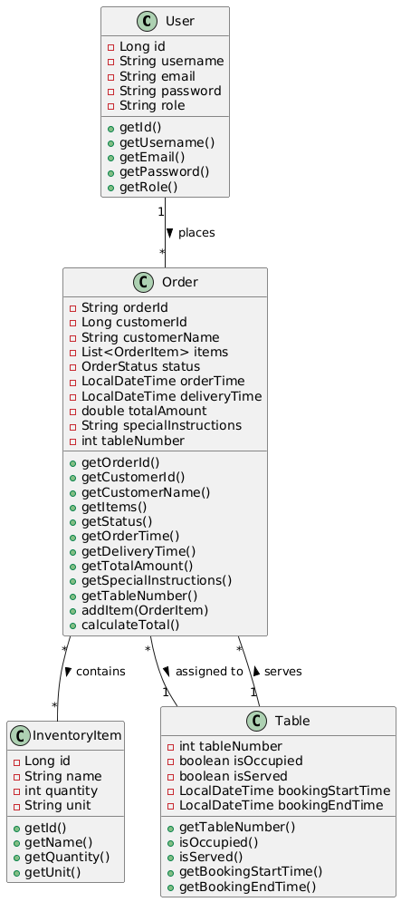
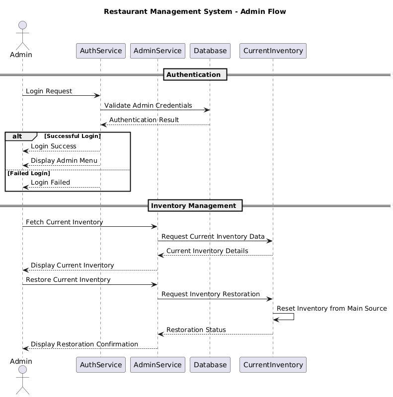
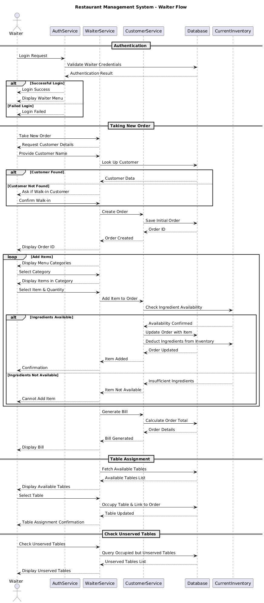
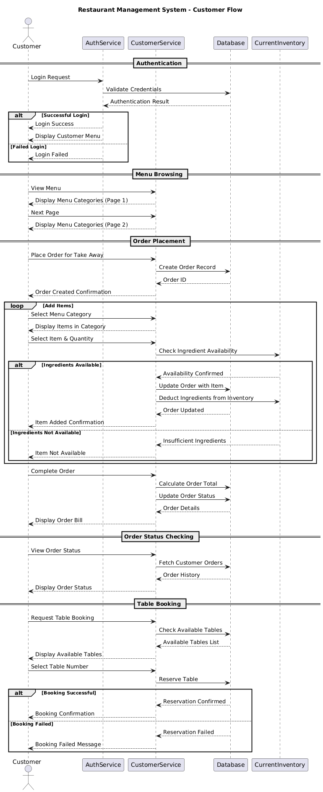

# Restaurant Management System

A comprehensive restaurant management solution that handles orders, inventory, table bookings, and user management with role-based access control. This system provides an end-to-end solution for restaurants to manage their daily operations efficiently.

## Table of Contents
- [Installation](#installation)
- [Usage](#usage)
- [System Architecture](#system-architecture)
- [Features](#features)
- [Database Structure](#database-structure)
- [Workflow Details](#workflow-details)
- [Sequence Diagrams](#sequence-diagrams)
- [Technical Specifications](#technical-specifications)
- [Project Structure](#project-structure)

## Installation

### Prerequisites
- Rancher Desktop (for Docker support)
- Git
- Java 11 or higher
- PostgreSQL 13 or higher (handled by Docker)
- Maven 3.6 or higher (for development)

### Steps
1. Install Rancher Desktop from [https://rancherdesktop.io/](https://rancherdesktop.io/)
2. Start Rancher Desktop
3. Clone the repository:
   ```
   git clone https://github.com/your-username/RestaurantManagementSystem.git
   cd RestaurantManagementSystem
   ```
4. Build the application with migrations:
   ```
   docker compose --profile migrations build
   ```
5. Start the application:
   ```
   docker compose up -d
   ```

## Usage

### Running the Application
1. Connect to the running container:
   ```
   docker exec -it restaurant_management_app /bin/bash
   ```
2. Run the application:
   ```
   java -jar app.jar
   ```

### Login Credentials
- **Admin**: `admin@example.com` / `admin123`
- **Waiter**: `waiter1@example.com` / `waiter123`
- **Customer**: `customer1@example.com` / `customer123`

### Role-Based Menu Options

#### Admin Menu
```
=== ADMIN MENU ===
3. Fetch Current Inventory
4. Restore Current Inventory
0. Logout
```

#### Waiter Menu
```
=== WAITER MENU ===
1. Take New Order
2. Check Unserved Tables
0. Logout
```

#### Customer Menu
```
=== CUSTOMER MENU ===
1. View Menu
2. Place Order for Take Away
3. View Order Status
4. Book Table
0. Logout
```

## System Architecture

The system follows a layered architecture pattern with clear separation of concerns:

1. **Presentation Layer**: Command-line interface for user interaction
   - Handles user input and displays formatted output
   - Implements role-based menu systems

2. **Service Layer**: Business logic implementation for different user roles
   - `AdminService`: Inventory management functions
   - `WaiterService`: Table and order management for waiters
   - `CustomerService`: Menu viewing, ordering, and booking for customers
   - `AuthService`: Authentication and authorization

3. **Data Access Layer**: Database operations via JDBC
   - `DatabaseUtil`: Connection management and SQL execution
   - Transaction management for data integrity

4. **Model Layer**: Java beans representing the domain entities
   - `User`: User information and role
   - `Order`: Order details and status
   - `Table`: Restaurant table information
   - `OrderItem`: Individual items in an order
   - `InventoryItem`: Ingredients and quantities

### Class Diagram


*The class diagram shows the relationships between key entities in the system. The User class has a one-to-many relationship with Orders, while Orders contain OrderItems and can be assigned to Tables.*

## Features

### Authentication System
- Secure role-based authentication 
- Password validation
- Session management
- User registration for customers

### User Management
- Role-based access control (Admin, Waiter, Customer)
- User registration and login
- Profile management

### Inventory Management (Admin)
- **Fetch Current Inventory**: View current stock levels of all ingredients
- **Restore Current Inventory**: Reset inventory to original levels from main source
- Real-time inventory tracking as orders are placed
- Automatic ingredient deduction for each order

### Order Management (Waiter)
- Take new orders for customers or walk-ins
- Add multiple items to orders
- Real-time inventory checking
- Bill generation with taxes and service charges
- Table assignment for dine-in customers

### Table Management (Waiter)
- Track table occupation status
- Monitor which tables have been served
- View list of unserved tables
- Manage table reservations

### Customer Features
- Browse complete restaurant menu with prices
- Place take-away orders
- Track order status
- Book tables in advance
- View order history

## Database Structure

The system uses a PostgreSQL database with the following structure:

### Entity-Relationship Diagram


*The ER diagram illustrates the database schema with tables for Users, Orders, Tables, and their relationships.*

### Tables
1. **Users**
   - `id`: SERIAL PRIMARY KEY
   - `username`: VARCHAR(100) NOT NULL UNIQUE
   - `email`: VARCHAR(100) NOT NULL UNIQUE
   - `password`: VARCHAR(255) NOT NULL
   - `role`: VARCHAR(20) NOT NULL
   - `created_at`: TIMESTAMP WITH TIME ZONE
   - `last_login`: TIMESTAMP WITH TIME ZONE

2. **Orders**
   - `id`: SERIAL PRIMARY KEY
   - `order_id`: VARCHAR(50) NOT NULL UNIQUE
   - `customer_id`: BIGINT REFERENCES users(id)
   - `order_timestamp`: TIMESTAMP WITH TIME ZONE
   - `items`: JSONB NOT NULL
   - `bill_subtotal`: NUMERIC(10,2) NOT NULL
   - `cgst_sgst`: NUMERIC(10,2)
   - `service_charge`: NUMERIC(10,2)
   - `bill_total`: NUMERIC(10,2) NOT NULL
   - `payment_status`: VARCHAR(20)
   - `order_status`: VARCHAR(20)
   - `table_number`: INT
   - `special_instructions`: TEXT

3. **Tables**
   - `id`: SERIAL PRIMARY KEY
   - `table_number`: INT NOT NULL UNIQUE
   - `is_occupied`: BOOLEAN
   - `is_served`: BOOLEAN
   - `booking_start_time`: TIMESTAMP
   - `booking_end_time`: TIMESTAMP

4. **OrderTable** (Junction table)
   - `id`: SERIAL PRIMARY KEY
   - `order_id`: BIGINT REFERENCES orders(id)
   - `table_id`: INT REFERENCES tables(id)
   - `created_at`: TIMESTAMP

5. **TableReservation**
   - `id`: SERIAL PRIMARY KEY
   - `table_id`: INT REFERENCES tables(id)
   - `customer_id`: BIGINT REFERENCES users(id)
   - `reservation_time`: TIMESTAMP WITH TIME ZONE
   - `status`: VARCHAR(20) NOT NULL
   - `notes`: TEXT

## Workflow Details

### Authentication Flow
1. User enters email and password
2. System validates credentials against database
3. Upon successful authentication, user's role is determined
4. Role-specific menu is displayed
5. Failed login attempts are tracked and limited

### Order Placement Flow
1. Customer/Waiter initiates order creation
2. System assigns a unique order ID
3. User browses menu categories and selects items
4. For each item:
   - System checks ingredient availability
   - If available, item is added to order
   - Inventory is updated
5. Order is finalized with billing calculation
6. Payment is processed
7. For dine-in orders, table is assigned

### Table Booking Flow
1. Customer selects "Book Table" option
2. System displays available tables
3. Customer selects desired table
4. System checks table availability
5. If available, table is marked as reserved
6. Reservation is recorded with timestamp
7. Confirmation is displayed to customer

### Inventory Management Flow
1. Admin selects inventory management option
2. For "Fetch Current Inventory":
   - System retrieves current inventory levels
   - Formatted inventory report is displayed
3. For "Restore Current Inventory":
   - System resets inventory to default levels
   - Confirmation is displayed

## Sequence Diagrams

### Admin Flow


*This diagram shows the interaction between the Admin user, AuthService, AdminService, and inventory components.*

### Waiter Flow


*This diagram illustrates how a waiter takes orders, checks table status, and manages customer seating.*

### Customer Flow


*This diagram demonstrates the customer journey from menu browsing to order placement and table booking.*

## Technical Specifications

### Technology Stack
- **Language**: Java 11
- **Build Tool**: Maven
- **Database**: PostgreSQL 13
- **Containerization**: Docker & Docker Compose
- **Logging**: SLF4J with Logback
- **JSON Processing**: org.json library
- **Testing**: JUnit 5

### Design Patterns Used
- **Singleton Pattern**: For database connection management
- **Factory Pattern**: For service initialization
- **DAO Pattern**: For database access
- **Service Layer Pattern**: For business logic encapsulation
- **MVC-inspired Structure**: For separation of concerns

### Transaction Management
- Critical database operations use SQL transactions to maintain data integrity
- Examples include order creation, table booking, and inventory updates
- Proper commit/rollback handling for error scenarios
- Inventory adjustments are tied to successful order processing

### Error Handling
- Comprehensive error logging using SLF4J
- Graceful handling of edge cases:
  - Ingredient shortages
  - Database connection issues
  - Invalid user inputs
  - Concurrent modification attempts

### Security Considerations
- Password storage (currently plaintext, would be hashed in production)
- Input validation to prevent SQL injection
- Session management
- Role-based access control

## Project Structure

```
RestaurantManagementSystem/
├── docker-compose.yml     # Docker configuration
├── Dockerfile             # Docker build configuration
├── pom.xml                # Maven dependencies and build config
├── README.md              # Documentation
├── migrations/            # Database migration scripts
│   ├── 001_create_migrations_table.sql
│   ├── 002_add_table_reservations.sql
│   └── init-db.sh         # Database initialization script
└── src/
    ├── main/
    │   ├── java/
    │   │   └── zeta/
    │   │       └── foods/
    │   │           ├── Main.java            # Application entry point
    │   │           ├── model/               # Domain models
    │   │           ├── service/             # Service interfaces
    │   │           │   └── impl/            # Service implementations
    │   │           ├── simulation/          # Test simulation code
    │   │           └── utils/               # Utility classes
    │   └── resources/                       # Configuration and data files
    └── test/
        └── java/                            # Test classes
```

## GitHub Repository

The complete source code for this project is available at:
[https://github.com/your-username/RestaurantManagementSystem](https://github.com/your-username/RestaurantManagementSystem)

Please refer to the repository for the latest updates and full codebase.
